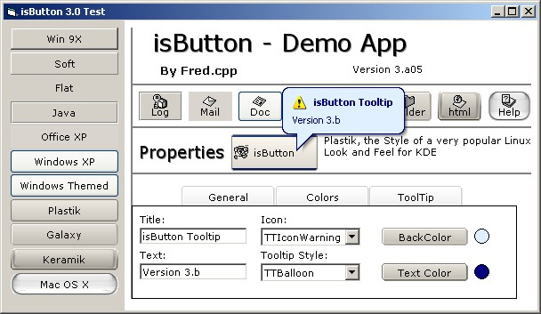



## isButton 3\.0 With Multiple Visual Styles, and more features\. Updated: 2004\-sep\-15

### Description

Do you want to change the style of your boring command buttons? try this cuztomizable button, drawn by code, baloon tooltips, 10 Visual Styles( winXP, Office XP, Mac OSX and more!), customizable caption and icon align and more! See screenshot. Also Includes a very creative way to show a about box Without add a extra form (using some api calls). The button is a single file control, without more dependences than VB Itself. uses Paul Caton Self subclasser: ' http://www.planetsourcecode.com/vb/scripts/ShowCode.asp?txtCodeId=54117&lngWId=1 Feedback Is highly apreciated. I'm working on the MacOSX style, since I need a faster way to draw It. Please coment. also, votes are wellcome. I've made a page for the control: http://www.geocities.com/isbutton3/

Update Includes lot of fixes and Checkbox behavior and Value property. If you want a Multy style ComboBox try SComboBox ( http://www.planet-source-code.com/vb/scripts/ShowCode.asp?lngWId=1&txtCodeId=56157 )

Regards and Have fun
 
### More Info
 

             |
---                |---
**Submitted On**   |2004-09-15 02:29:54
**By**             |[Fred\.cpp](https://github.com/Planet-Source-Code/PSCIndex/blob/master/ByAuthor/fred-cpp.md)
**Level**          |Intermediate
**User Rating**    |5.0 (575 globes from 116 users)
**Compatibility**  |VB 6\.0
**Category**       |[Custom Controls/ Forms/  Menus](https://github.com/Planet-Source-Code/PSCIndex/blob/master/ByCategory/custom-controls-forms-menus__1-4.md)
**World**          |[Visual Basic](https://github.com/Planet-Source-Code/PSCIndex/blob/master/ByWorld/visual-basic.md)
**Archive File**   |[isButton\_31793829152004\.zip](https://github.com/Planet-Source-Code/fred-cpp-isbutton-3-0-with-multiple-visual-styles-and-more-features-updated-2004-sep-15__1-56053/archive/master.zip)

### API Declarations

tons

